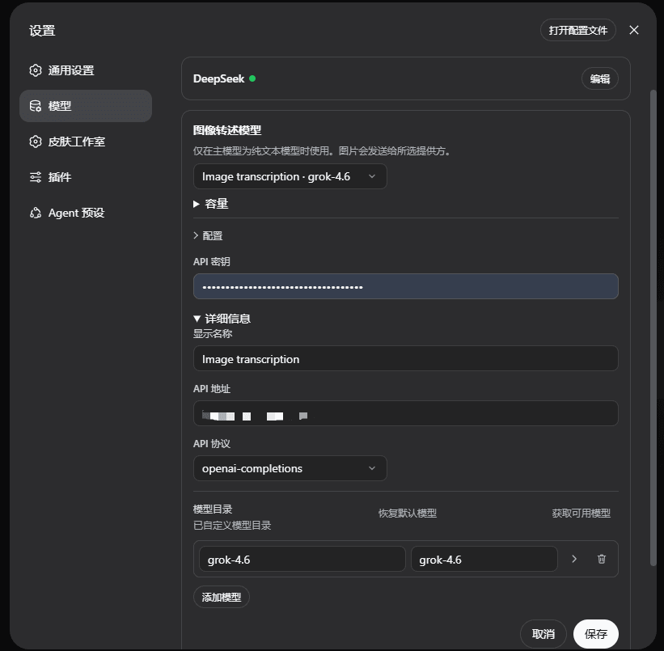

# DSH Image Transcription Plugin

[中文](README.zh-CN.md) · [Upstream: DeepSeek Harness](https://github.com/deepseek-ai/deepseek-harness) · [Topic](https://github.com/topics/dsh-plugin)

A source release for the DeepSeek Harness image-transcription feature. It is implemented as two Cordis plugins:

- `@deepseek-ai/dsh-image-transcription` converts image-bearing messages into durable visual transcriptions when the primary model is text-only.
- `@deepseek-ai/dsh-tool-image-recall` registers `recall_image`, allowing the primary model to ask the configured vision model to re-read a cited historical image.

## Features

- Stable `transcriptionId` references bind text transcriptions to their original attachments.
- Compaction adds a compact image index; original attachments remain stored in the session log.
- `recall_image` sends only the cited image batch and the current question to the visual route.
- The Web UI shows elapsed transcription status and retains clear failures.

## Configure the image-transcription model

This plugin requires an image-transcription model configuration before it can process images.

1. Open **Settings → Models**.
2. In **Image transcription model**, select the visual provider and model to use when the primary model is text-only.
3. Expand **Configuration** and enter the provider API key, endpoint, protocol, and available model ID.
4. Save the configuration.

## License and attribution

This release contains modifications to [DeepSeek Harness](https://github.com/deepseek-ai/deepseek-harness), licensed under MIT. Keep the included `LICENSE` and retain upstream attribution in derivative distributions.
